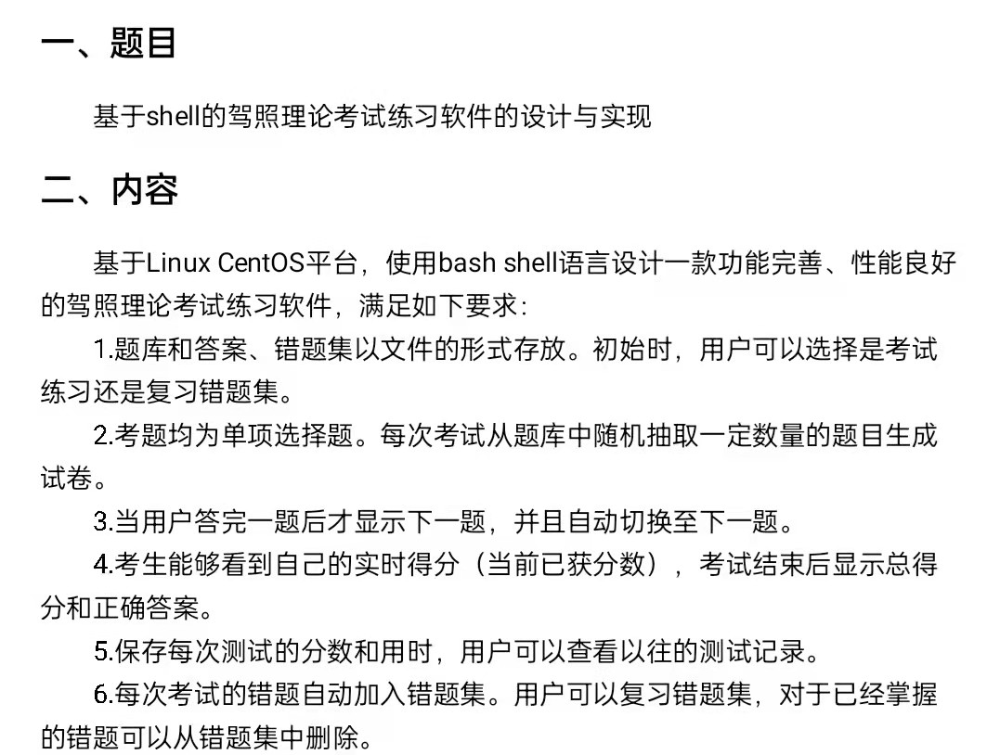

# exam-in-shell

基于 Shell 的驾照理论考试练习软件的设计与实现



## 测试题数据存储设计

```bash
# 测试题目文件夹
# 每个测试题作为一个目录，目录下面必须有 content.txt、options.txt 和 answer.txt 三个文件
# content.txt 文件内容为题目内容
# options.txt 文件内容为题目选项，每个选项占一行
# answer.txt 文件内容为正确答案
export tests_folder='./tests'
```

## 复习错题集自动删除答对的错题

```bash
export failed_list_file='failed.txt' # 错题集文件

sed -i '' "/$test/d" $failed_list_file
```

- [Linux sed 命令](https://www.runoob.com/linux/linux-comm-sed.html)
- [Sed: 'sed: 1: invalid command code R' on Mac OS X](https://www.markhneedham.com/blog/2011/01/14/sed-sed-1-invalid-command-code-r-on-mac-os-x/)

## 参考资料

- [shell 编程：冒号 后面跟 等号，加号，减号，问号的意义](https://handerfly.github.io/shell/2019/04/03/shell%E7%BC%96%E7%A8%8B%E5%86%92%E5%8F%B7%E5%8A%A0-%E7%AD%89%E5%8F%B7-%E5%8A%A0%E5%8F%B7-%E5%87%8F%E5%8F%B7-%E9%97%AE%E5%8F%B7/)

## Author

[K8sCat](https://github.com/k8scat)
